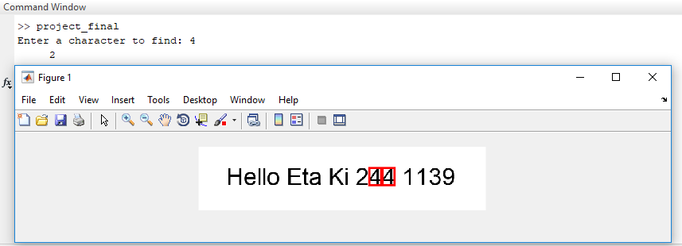

<h3>Project Description:</h3>

<b>Character Detection from an image:</b>

Count the number of occurrence of a character from a text image.

<figure>
  
  <figcaption>Character Detection Fig.</figcaption>
</figure> 

This is current semester (4.2) "CSE 4228: Digital Image Processing Lab Project" which we have made using matlab.

<h4>Group Project Members :</h4>
<ul style="list-style-type:square">
<li>Sagor Ahamed</li>

<li>Nabil Ahmed</li>

<li>Shanjoy Paul Shuvo</li>
</ul>